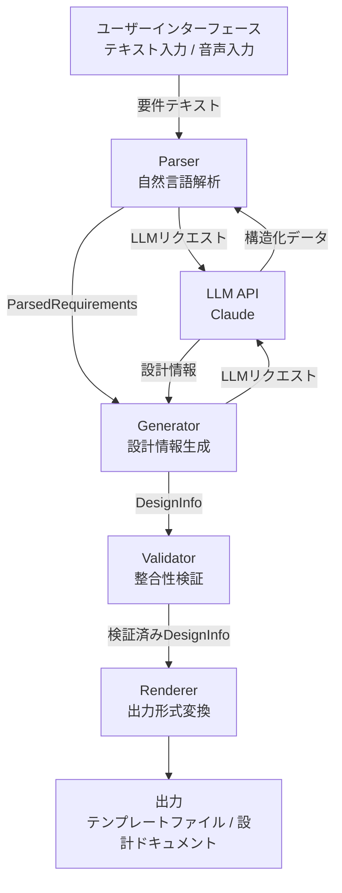
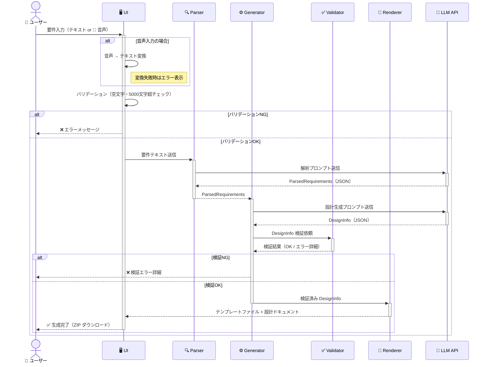
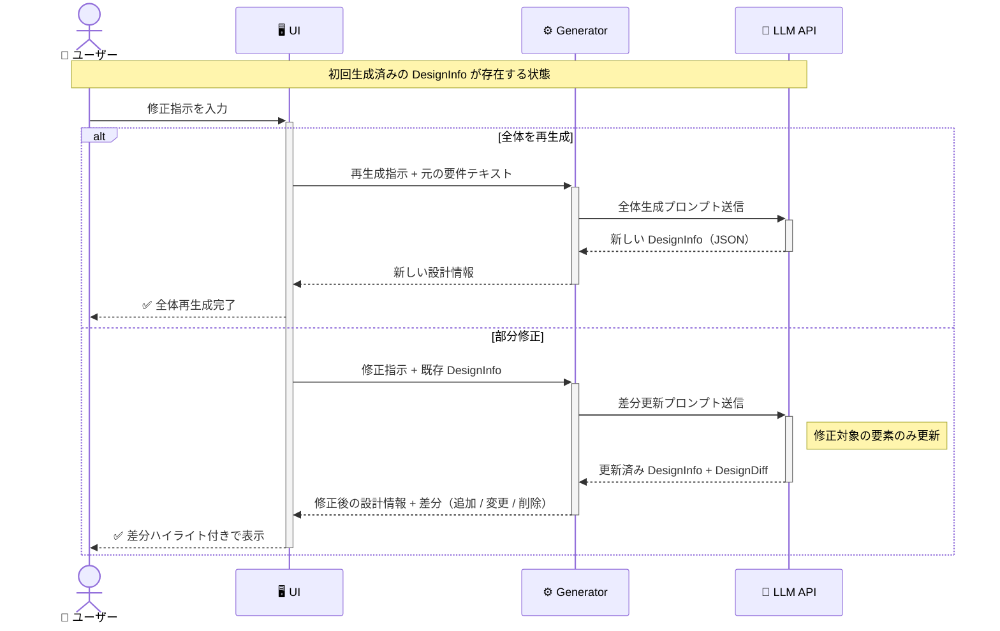

# デザインドキュメント: AppSuite 設計支援ツール

## 概要

本ドキュメントは、デスクネッツ ネオの業務アプリ作成ツール「AppSuite」向けアプリ設計支援ツールの技術設計を定義する。

ユーザーが自然言語（テキストまたは音声）でアプリ要件を入力すると、システムは以下を自動生成する：

- 設計ドキュメント（Markdown） — 部品定義表・リレーション設計・計算式・画面デザイン案・GUI操作ガイド
- AppSuite実形式のtemplate.json（参考資料。template.key署名問題により直接インポートは現時点で不可）

### 設計方針

- **パイプライン型アーキテクチャ**: 入力 → 解析 → 生成 → 検証 → 出力 の一方向データフロー
- **コンポーネント分離**: Parser / Generator / Renderer / Validator を独立したモジュールとして実装
- **LLM活用**: 自然言語解析・設計生成の中核にLLM（Claude API）を使用
- **設計ドキュメント中心**: 主出力は設計ドキュメントとGUI操作ガイド。テンプレートファイルは参考資料として出力

### template.key 制約事項

AppSuiteのテンプレートZIPには `template.key`（署名）が含まれ、`template.json` の内容に紐づいている。
署名アルゴリズムは非公開のため、外部で生成したテンプレートのAppSuiteへの直接インポートは現時点では不可。
ネオジャパンへの問い合わせ、またはサーバー側コード解析で署名ロジックが判明した場合に再開可能。

---

## アーキテクチャ

### システム全体構成



### データフロー



### 修正・再生成フロー



---

## コンポーネントとインターフェース

### Parser

自然言語テキストを構造化データ（`ParsedRequirements`）に変換する。

```typescript
interface Parser {
  parse(input: string): Promise<ParsedRequirements>;
}
```

**責務:**
- 入力バリデーション（空文字・文字数上限チェック）
- LLMへの解析プロンプト送信
- アプリ名・目的・想定ユーザー・主要機能の抽出
- 解析結果のJSON構造化

### Generator

`ParsedRequirements` を受け取り、全設計情報（`DesignInfo`）を生成する。

```typescript
interface Generator {
  generate(requirements: ParsedRequirements): Promise<DesignInfo>;
  regenerate(requirements: ParsedRequirements, instruction: string, existing: DesignInfo): Promise<RegenerateResult>;
  regenerateAll(requirements: ParsedRequirements): Promise<DesignInfo>;
}
```

**責務:**
- アプリ基本情報の生成（名前・アイコン・説明文）
- 部品定義表の生成
- リレーション設計の生成
- 計算式・自動設定ロジックの生成
- 画面デザイン案の生成（PC版必須、モバイル版はオプション）
- Claude Code用操作指示の生成

### Renderer

`DesignInfo` を各種出力形式に変換する。主出力は設計ドキュメントとGUI操作ガイド。

```typescript
interface Renderer {
  renderDesignDocument(design: DesignInfo): string;     // Markdown（主出力）
  renderGuiGuide(design: DesignInfo): string;           // GUI操作ガイド（Markdown）
  renderTemplate(design: DesignInfo): AppSuiteTemplateJson;  // 参考資料
  renderZipArchive(design: DesignInfo): Promise<Uint8Array>;
}
```

**責務:**
- **設計ドキュメント（Markdown）の生成**（主出力）
- **AppSuite GUI操作ガイドの生成** — アプリ作成・部品追加・ビュー設定のステップバイステップ手順
- AppSuiteテンプレートファイル（template.json）の生成（参考資料）
  - システムフィールド（id, 登録日時, 登録者, 更新日時, 更新者）の自動付与
  - ComponentType → AppSuiteFieldType の変換（例: text→textbox, calc→expression）
  - カードビュー・view_partsの自動生成
- ZIPアーカイブの生成（`design-document.md` + `gui-guide.md` + `template.json`）

### Validator

生成されたAppSuiteテンプレートファイルの整合性を検証する。

```typescript
interface Validator {
  validate(template: AppSuiteTemplateJson): ValidationResult;
}

interface ValidationResult {
  valid: boolean;
  errors: ValidationError[];
}

interface ValidationError {
  field: string;
  message: string;
}
```

**責務:**
- 必須フィールドの存在確認（バージョン・アプリ名・ユーザー定義フィールド）
- AppSuiteフィールドタイプの有効性確認
- 構造の整合性確認（テーブル・ビューの存在）

---

## データモデル

### ParsedRequirements

Parserが出力する構造化データ。

```typescript
interface ParsedRequirements {
  appName: string;           // 推定アプリ名
  purpose: string;           // アプリの目的
  targetUsers: string[];     // 想定ユーザー
  mainFeatures: string[];    // 主要機能リスト
  rawText: string;           // 元の入力テキスト
}
```

### DesignInfo

Generatorが生成する全設計情報。

```typescript
interface DesignInfo {
  appInfo: AppInfo;
  components: ComponentDefinition[];
  relations: RelationDefinition[];
  automations: AutomationDefinition[];
  layout: LayoutDefinition;
  claudeInstruction: string;
  generatedAt: string;       // ISO 8601形式
  inputSummary: string;
}
```

### AppInfo

```typescript
interface AppInfo {
  name: string;              // 20文字以内
  iconId: string;            // AppSuite標準アイコン識別子
  description: string;       // 200文字以内
}
```

### ComponentDefinition（部品定義）

```typescript
type ComponentType =
  | 'text'        // テキスト
  | 'textarea'    // テキストエリア
  | 'number'      // 数値
  | 'date'        // 日付
  | 'time'        // 時刻
  | 'select'      // 選択肢
  | 'checkbox'    // チェックボックス
  | 'attachment'  // 添付ファイル
  | 'relation'    // リレーション
  | 'calc'        // 計算
  | 'auto';       // 自動設定

interface ComponentDefinition {
  id: string;
  name: string;
  type: ComponentType;
  required: boolean;
  options?: string[];        // 選択肢タイプの場合
  formula?: string;          // 計算タイプの場合
  autoConfig?: AutoConfig;   // 自動設定タイプの場合
}
```

### ComponentType → AppSuiteFieldType マッピング

Generator が使用する `ComponentType` はLLM生成用の抽象型であり、Renderer が AppSuite 実テンプレートに変換する際に以下のマッピングが適用される。

| ComponentType | AppSuiteFieldType | 備考 |
|---|---|---|
| text | textbox | テキスト入力 |
| textarea | textarea | テキストエリア |
| number | number | 数値入力 |
| date | date | 日付入力 |
| time | time | 時刻入力 |
| select | select | 選択肢（ドロップダウン） |
| checkbox | checkbox | チェックボックス |
| attachment | files | 添付ファイル |
| relation | rel_list | リレーション（一覧表示） |
| calc | expression | 計算式 |
| auto | expression | 自動設定（tasksで表現） |

AppSuite が対応する全フィールドタイプ: `id`, `datetime`, `user`, `number`, `textbox`, `textarea`, `richeditor`, `files`, `input_list`, `select`, `listbox`, `radio`, `checkbox`, `users`, `groups`, `date`, `time`, `expression`, `rel_list`, `rel_field`

### RelationDefinition（リレーション定義）

```typescript
interface RelationDefinition {
  sourceApp: string;         // 参照元アプリ名
  targetApp: string;         // 参照先アプリ名（未定の場合はプレースホルダー）
  keyField: string;          // 紐付けキー
  fetchFields: string[];     // 取得フィールド
  comment: string;           // 紐付けの目的説明
}
```

### AutomationDefinition（自動設定・計算式定義）

```typescript
interface AutomationDefinition {
  type: 'calc' | 'auto';
  targetComponent: string;   // 対象部品ID
  formula?: string;          // 計算式（calcの場合）
  conditions?: AutoCondition[]; // 条件（autoの場合）
  comment: string;           // 動作説明
}

interface AutoCondition {
  field: string;
  operator: 'eq' | 'neq' | 'gt' | 'lt' | 'gte' | 'lte';
  value: string | number;
  setValue: string | number;
}
```

### LayoutDefinition（画面レイアウト定義）

```typescript
interface LayoutDefinition {
  pc: LayoutSection[];
  mobile?: LayoutSection[];  // ユーザーが選択した場合のみ
}

interface LayoutSection {
  sectionName: string;
  rows: LayoutRow[];
}

interface LayoutRow {
  components: string[];      // 部品IDのリスト（1行に複数配置可能）
}
```

### AppSuiteTemplateJson（テンプレートファイル — AppSuite実形式）

実物のAppSuiteテンプレートZIPを解析して定義。`template.json` のルート構造。

```typescript
interface AppSuiteTemplateJson {
  version: string;                    // 例: "1.0.9"
  applications: AppSuiteAppEntry[];
}

interface AppSuiteAppEntry {
  application: AppSuiteApplication;   // アプリメタ情報（Name, type_, overview_ 等）
  tables: AppSuiteTable[];            // テーブル定義
  table_fileds: AppSuiteField[];      // フィールド定義（※"fileds"はAppSuiteの実際のスペル）
  views: AppSuiteView[];              // 画面ビュー定義
  view_parts: AppSuiteViewPart[];     // ビュー上の部品配置
  filters: unknown[];                 // フィルター定義
  tasks: unknown[];                   // 自動化タスク定義
  task_actions: unknown[];            // タスクアクション定義
  // ... 他21キー（aggr_settings, validations 等）
}
```

ZIP アーカイブ内のファイル構成:
- `template.json` — アプリ定義本体
- `template_desc.json` — メタ情報 `{ Name, overview, filename, mimetype }`
- `template.key` — 認証キー
- `icon.png` — アプリアイコン画像（オプション）
- `pu_att/` — 添付画像アセット（オプション）

### RegenerateResult（再生成結果）

```typescript
interface RegenerateResult {
  updated: DesignInfo;
  diff: DesignDiff;
}

interface DesignDiff {
  added: string[];           // 追加された要素の説明
  modified: string[];        // 変更された要素の説明
  removed: string[];         // 削除された要素の説明
}
```

---

## 正確性プロパティ

*プロパティとは、システムの全ての有効な実行において成立すべき特性または振る舞いのことである。人間が読める仕様と機械検証可能な正確性保証の橋渡しとなる形式的な記述である。*

### プロパティ1: 解析結果の構造完全性

*任意の* 有効な入力テキストに対して、Parserの解析結果にはアプリ名・目的・想定ユーザー・主要機能の全フィールドが含まれなければならない

**検証対象: 要件 1.5, 1.8**

---

### プロパティ2: 空白入力の拒否

*任意の* 空白文字のみで構成される文字列（空文字・スペースのみ・タブのみ等）に対して、Generatorはエラーメッセージ「要件を入力してください」を返さなければならない

**検証対象: 要件 1.6**

---

### プロパティ3: 文字数上限の強制

*任意の* 5000文字を超える文字列に対して、Generatorはエラーメッセージ「入力は5000文字以内にしてください」を返さなければならない

**検証対象: 要件 1.7**

---

### プロパティ4: アプリ名の文字数制約

*任意の* ParsedRequirementsに対して、Generatorが生成するアプリ名は20文字以内でなければならない

**検証対象: 要件 2.1**

---

### プロパティ5: アイコン識別子の有効性

*任意の* ParsedRequirementsに対して、Generatorが選択するアイコン識別子はAppSuite標準アイコンセットに含まれる値でなければならない

**検証対象: 要件 2.2**

---

### プロパティ6: 説明文の文字数制約

*任意の* ParsedRequirementsに対して、Generatorが生成するアプリ説明文は200文字以内でなければならない

**検証対象: 要件 2.3**

---

### プロパティ7: 部品定義の完全性と有効性

*任意の* ParsedRequirementsに対して、生成される全部品定義は（1）部品名・部品タイプ・必須チェックの全フィールドを持ち、（2）部品タイプがAppSuiteの有効な部品タイプセット（text/textarea/number/date/time/select/checkbox/attachment/relation/calc/auto）に含まれなければならない

**検証対象: 要件 3.1, 3.2**

---

### プロパティ8: 数値項目の部品タイプ割り当て

*任意の* 金額・数量・合計等の数値項目を含む要件に対して、該当部品のタイプは「number」または「calc」として定義されなければならない

**検証対象: 要件 3.3**

---

### プロパティ9: 択一項目の部品タイプ割り当て

*任意の* 承認・確認・選択等の択一項目を含む要件に対して、該当部品のタイプは「select」または「checkbox」として定義されなければならない

**検証対象: 要件 3.4**

---

### プロパティ10: Markdown出力形式の保証

*任意の* 設計情報に対して、部品定義表およびリレーション設計の出力はMarkdownテーブル形式（`|`区切り）でなければならない

**検証対象: 要件 3.5, 4.4**

---

### プロパティ11: リレーションコメントの存在

*任意の* リレーション定義に対して、紐付けの目的を説明するコメントフィールドが存在し、空文字列でないことを保証しなければならない

**検証対象: 要件 4.2**

---

### プロパティ12: 自動化定義のコメント存在

*任意の* 計算式または自動設定ロジックの定義に対して、動作説明コメントフィールドが存在し、空文字列でないことを保証しなければならない

**検証対象: 要件 5.3**

---

### プロパティ13: PC版レイアウトの必須生成

*任意の* 部品定義表に対して、PC版レイアウト案が生成され、全部品がいずれかのセクションに配置され、各セクションにセクション名が付与されなければならない

**検証対象: 要件 6.1, 6.4**

---

### プロパティ14: モバイル版レイアウトの縦1列制約

*任意の* モバイル版レイアウトにおいて、全ての行に含まれる部品数は1でなければならない

**検証対象: 要件 6.6**

---

### プロパティ15: Claude Code操作指示の完全性

*任意の* 設計情報に対して、生成されるClaude Code用操作指示は（1）アプリ基本情報・部品定義・リレーション設計・計算式・画面レイアウトの全情報を含み、（2）Markdownコードブロック形式で出力され、（3）AppSuiteテンプレートファイル形式（AppSuite実形式のJSON）の仕様を明示しなければならない

**検証対象: 要件 7.1, 7.2, 7.3, 7.4**

---

### プロパティ16: テンプレートファイルの必須フィールド検証

*任意の* 生成されたテンプレートファイルに対して、Validatorはアプリ名・部品定義・バージョン情報の必須フィールドが存在することを検証しなければならない

**検証対象: 要件 8.2**

---

### プロパティ17: テンプレートファイルの生成冪等性

*任意の* 有効なDesignInfoオブジェクトに対して、同じDesignInfoからテンプレートファイルを2回生成した結果は同一でなければならない

**検証対象: 要件 8.5**

---

### プロパティ18: 設計ドキュメントの完全性

*任意の* 設計情報に対して、生成される設計ドキュメントはアプリ基本情報・部品定義表・リレーション設計・計算式・画面デザイン案・Claude Code用操作指示・生成日時・入力要件サマリーの全セクションを含まなければならない

**検証対象: 要件 9.1, 9.2**

---

### プロパティ19: ZIPアーカイブの内容完全性

*任意の* 設計情報に対して、生成されるZIPアーカイブには `template.json`（AppSuite実形式）、`template_desc.json`、および設計ドキュメント（`design-document.md`）が含まれなければならない

**検証対象: 要件 9.3**

---

### プロパティ20: 部分再生成の整合性

*任意の* 修正指示と既存設計情報に対して、再生成後の設計情報は（1）修正指示に関係しない設計要素が変更されておらず、（2）差分情報（追加・変更・削除）が明示されなければならない

**検証対象: 要件 10.2, 10.3**

---

## エラーハンドリング

### 入力バリデーションエラー

| エラー条件 | エラーメッセージ | 処理 |
|---|---|---|
| 空文字列・空白のみ | 「要件を入力してください」 | 処理中断、入力欄にフォーカス |
| 5000文字超 | 「入力は5000文字以内にしてください」 | 処理中断、文字数カウント表示 |
| 音声認識失敗 | 「音声を認識できませんでした。もう一度お試しいただくか、テキストで入力してください」 | 音声入力モードを維持 |

### 生成エラー

| エラー条件 | 処理 |
|---|---|
| アプリ名生成失敗 | デフォルト値「新規アプリ」を使用して処理継続 |
| 計算式に必要な部品が不足 | 不足部品を部品定義表に自動追加して処理継続 |
| リレーション対象アプリが不明 | プレースホルダー「[既存アプリ名を指定してください]」を使用して処理継続 |
| LLM API呼び出し失敗 | リトライ（最大3回）後、エラーメッセージを表示 |

### 検証エラー

| エラー条件 | 処理 |
|---|---|
| テンプレートファイルの必須フィールド不足 | 不足フィールドを特定し、エラー詳細メッセージを返す |
| 無効な部品タイプ | 検証エラーとして報告し、有効な部品タイプ一覧を提示 |

### エラー設計方針

- **フェイルセーフ**: 部分的な生成失敗はデフォルト値やプレースホルダーで補完し、処理を継続する
- **エラー詳細**: 検証エラーは不足フィールドを特定して具体的なメッセージを返す
- **リトライ**: LLM API呼び出しは最大3回リトライし、全て失敗した場合のみエラーを返す

---

## Web UI アーキテクチャ

### 概要

ブラウザ上のチャット風UIからPipelineを操作するためのWeb層。APIキーをブラウザに露出させないため、Expressサーバーをプロキシとして配置する。

### 技術選定

| 項目 | 選定 | 理由 |
|------|------|------|
| フロントエンド | Vanilla TS + lit-html | 3KBのテンプレートライブラリ。チャットのメッセージ追加に十分 |
| サーバー | Express（APIプロキシ） | Claude SDKはNode.js前提。APIキーをサーバー側で管理 |
| バンドラー | Vite | TS対応済み、設定最小、HMR付き |
| Markdown表示 | marked + DOMPurify | Markdown→HTMLの変換とXSSサニタイズ |

### システム構成

```
ブラウザ (lit-html + AudioInput)
    ↕ fetch POST /api/*
Express サーバー (port 3001)
    ↕ Pipeline.run() / regenerate()
Claude API
```

### ディレクトリ構成

```
web/
  package.json
  tsconfig.json
  vite.config.ts
  server/
    index.ts          Express サーバー起点
    routes.ts         API エンドポイント
  client/
    index.html        HTMLシェル
    main.ts           エントリポイント
    chat-state.ts     チャット状態管理
    chat-ui.ts        メッセージ一覧・入力欄の描画
    result-view.ts    生成結果の展開表示・ダウンロード
    audio-button.ts   音声入力ボタン（既存AudioInput再利用）
    markdown-utils.ts Markdownサニタイズユーティリティ
    styles.css        チャットUIスタイル
```

### APIエンドポイント

```
POST /api/generate
  Body: { input: string }
  Response: { design, designDocument, guiGuide, validation, zipBase64 }

POST /api/regenerate
  Body: { originalInput, instruction, existing }
  Response: { regenerateResult, designDocument, guiGuide, validation, zipBase64 }
```

### チャットフロー

1. 初期メッセージ: ウェルカムメッセージ表示
2. ユーザーが入力 → `POST /api/generate` → アシスタントが設計結果を表示
3. ユーザーが追加指示 → `POST /api/regenerate` → 差分付きで結果更新
4. ZIPダウンロードボタンで成果物取得

### チャット状態管理

```typescript
class ChatState {
  messages: ChatMessage[]
  originalInput: string        // 最初のユーザー入力（regenerate用）
  currentDesign: DesignInfo | null  // 最新の設計情報（regenerate用）
  isGenerating: boolean
}
```

### セキュリティ対策

- APIキーはサーバー側の `.env` で管理（ブラウザ非露出）
- LLM生成コンテンツは `DOMPurify.sanitize()` でサニタイズ後に描画
- 入力長はクライアント側（5000文字）とサーバー側（CONSTRAINTS.MAX_INPUT_LENGTH）で二重検証
- `existing` オブジェクトの形状検証（appInfo, components, relations, automations, layout）
- Express JSONボディサイズ制限（1MB）

### 再利用する既存コード

| ファイル | 用途 |
|---------|------|
| `src/pipeline/index.ts` | Pipeline クラス（サーバーから直接利用） |
| `src/audio/index.ts` | AudioInput クラス（クライアントから直接利用） |
| `src/types/index.ts` | DesignInfo 等の型定義（共有） |
| `src/types/errors.ts` | エラークラス・定数（サーバーで利用） |

---

## テスト戦略

### デュアルテストアプローチ

本機能のテストは**ユニットテスト**と**プロパティベーステスト**の両方を組み合わせて実施する。

- **ユニットテスト**: 特定の入力例・エッジケース・エラー条件を検証
- **プロパティベーステスト**: 全入力に対して成立すべき普遍的プロパティを検証

### プロパティベーステストライブラリ

TypeScript/JavaScript環境では **fast-check** を使用する。

```bash
npm install --save-dev fast-check
```

各プロパティテストは最低100回のイテレーションを実行する。

### プロパティテストの実装方針

各プロパティテストには以下のタグコメントを付与する：

```typescript
// Feature: appsuite-template-generator, Property {番号}: {プロパティ名}
```

各正確性プロパティは1つのプロパティベーステストで実装する。

#### プロパティテスト例

```typescript
import * as fc from 'fast-check';

// Feature: appsuite-template-generator, Property 2: 空白入力の拒否
test('空白のみの入力はエラーを返す', () => {
  fc.assert(
    fc.property(
      fc.stringOf(fc.constantFrom(' ', '\t', '\n', '\r')),
      (whitespaceInput) => {
        const result = generator.validate(whitespaceInput);
        expect(result.error).toBe('要件を入力してください');
      }
    ),
    { numRuns: 100 }
  );
});

// Feature: appsuite-template-generator, Property 4: アプリ名の文字数制約
test('生成されるアプリ名は20文字以内', () => {
  fc.assert(
    fc.property(
      parsedRequirementsArbitrary(),
      async (requirements) => {
        const design = await generator.generate(requirements);
        expect(design.appInfo.name.length).toBeLessThanOrEqual(20);
      }
    ),
    { numRuns: 100 }
  );
});

// Feature: appsuite-template-generator, Property 17: テンプレートファイルのラウンドトリップ
test('テンプレートファイルのラウンドトリップ', () => {
  fc.assert(
    fc.property(
      designInfoArbitrary(),
      (designInfo) => {
        const template = renderer.renderTemplate(designInfo);
        const parsed = parseTemplate(template);
        const regenerated = renderer.renderTemplate(parsed);
        expect(regenerated).toEqual(template);
      }
    ),
    { numRuns: 100 }
  );
});
```

### ユニットテストの対象

ユニットテストは以下に集中させる（プロパティテストで網羅できない部分）：

- **特定のエラーメッセージ**: 音声認識失敗・文字数超過等の具体的なエラー文言
- **エッジケース**: アプリ名生成失敗時のデフォルト値、不足部品の自動追加
- **統合ポイント**: LLM APIとのインターフェース、ZIPアーカイブ生成
- **UIインタラクション**: 音声入力→テキスト反映、モバイル版レイアウト選択

### テスト構成

```
src/
  __tests__/
    unit/
      parser.test.ts          # Parser のユニットテスト
      generator.test.ts       # Generator のユニットテスト
      validator.test.ts       # Validator のユニットテスト
      renderer.test.ts        # Renderer のユニットテスト
    property/
      parser.property.test.ts     # プロパティ1〜3
      generator.property.test.ts  # プロパティ4〜15
      validator.property.test.ts  # プロパティ16
      renderer.property.test.ts   # プロパティ17〜19
      regenerate.property.test.ts # プロパティ20
    integration/
      full-pipeline.test.ts   # エンドツーエンドの統合テスト
```

### テスト実行

```bash
# 単発実行（CI/CD向け）
npx vitest --run

# プロパティテストのみ
npx vitest --run src/__tests__/property
```
